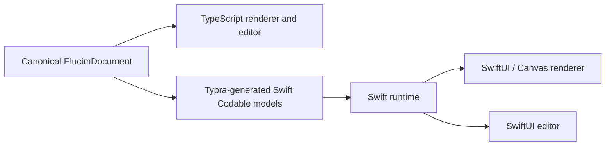

Elucim documents can be consumed by native iOS and macOS applications without making a WebView the primary runtime. The canonical `ElucimDocument` is the cross-platform contract: a native renderer and editor read, modify, validate, and serialize the same document model as the web packages.

## Architecture

Use Typra to generate Swift `Codable` models from the canonical document schema. Use those models for transport and persistence, not as a replacement for native rendering.



The TypeScript implementation remains the reference implementation. Both runtimes use shared document fixtures to verify validation, timeline projection, state-machine behavior, commands, and serialization.

## Native rendering

Implement the renderer as a scene graph projected from a document at a specific frame:

1. Process state-machine inputs and select the active timeline or timelines.
2. Evaluate tracks, reveal effects, and camera keyframes into a frame-specific render projection.
3. Resolve theme tokens, apply camera and layout transforms, sort by `zIndex`, and draw the projected element tree.

Use SwiftUI `Canvas` and `GraphicsContext` for the SVG-like primitives:

| DSL element | Native implementation |
| --- | --- |
| `rect`, `circle`, `line`, `polygon`, `arrow`, `bezierCurve` | `Path` and `GraphicsContext` |
| `group` | Recursive rendering with concatenated layout transforms |
| `text`, `textbox` | `GraphicsContext.draw(Text(...))`; Core Text when exact typography control is required |
| `image` | Host-owned asset resolver returning `CGImage` or SwiftUI `Image` |
| `axes`, charts, graphs, vectors | Composed paths, labels, markers, and clipping regions |
| `functionPlot`, `vectorField` | Safe expression AST evaluation followed by deterministic path sampling |
| `latex` | Precompiled SVG/path fallback initially; native math layout only when required |

Keep rendering deterministic: the same document, frame, dimensions, theme, and assets must produce the same scene on each platform. A server-produced SVG can be a temporary fallback for unsupported elements, but not the primary rendering path.

## Native editor parity

Full editor parity is feasible when compatibility is defined by document behavior rather than the React component tree. The native editor should provide platform-native SwiftUI surfaces while preserving these shared semantics:

| Concern | Compatibility boundary |
| --- | --- |
| Document structure and validation | Canonical schema, generated Swift models, and shared validation fixtures |
| Editing operations | Serialized editor commands such as insert, delete, patch props, reparent, resize, and timeline edits |
| Undo and redo | Command history with identical document-in and document-out results |
| Selection, transforms, snapping, and bounds | Shared geometry and interaction fixtures |
| Timelines and state machines | Shared evaluation and transition fixtures |
| Rendering and hit testing | Shared coordinate, transform, and visual snapshot fixtures |
| Inspector, hierarchy, and timeline UI | Native SwiftUI implementations over the shared command model |

Make editor commands explicit before porting the editor. The TypeScript and Swift reducers should both run the same golden corpus:

```text
initial document + command sequence = expected canonical document
```

This makes undo/redo, import/export, and cross-platform editing predictable without forcing an identical UI.

## Recommended rollout

1. Promote canonical elements from a string `type` plus untyped props into a typed discriminated union, then generate Swift models with Typra.
2. Build a read-only native viewer for static primitives, themes, assets, camera transforms, and frame projection.
3. Add state-machine input handling, timeline playback, reveal effects, and native controls.
4. Extract the web editor's semantic operations into an explicit serialized command model with golden tests.
5. Build native selection, hit testing, transforms, snapping, inspector, hierarchy, timeline, and undo/redo on that command model.
6. Run TypeScript and Swift fixture suites in CI, adding visual regression tests where platform rendering should match.

## WebView role

A WebView can deliver immediate functional coverage or provide a fallback while individual native primitives mature. It should not be the primary renderer or editor for a native product: native SwiftUI and Canvas give better accessibility, performance, offline behavior, export integration, and platform interaction.
